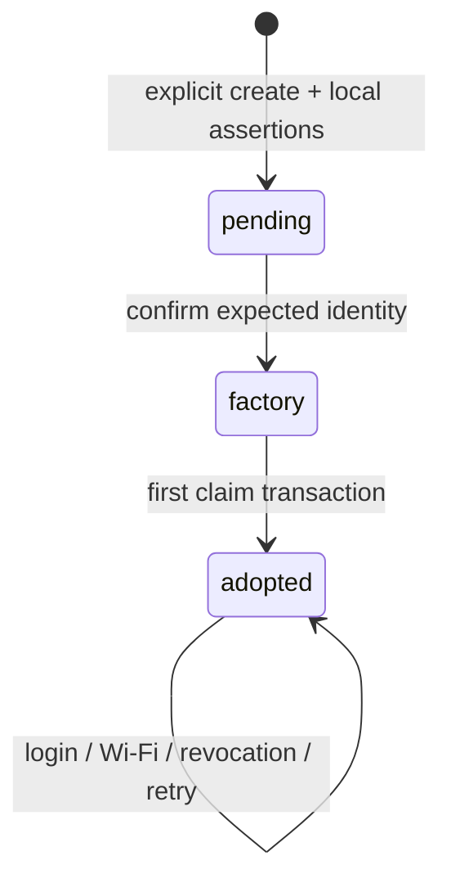

# Factory ownership state — internal opt-in foundation

This implementation is the first application-side subset of
[FIRST-BOOT-CONTRACT.md](FIRST-BOOT-CONTRACT.md). It is not an executable InkyOS
first boot. No runtime, CLI, environment flag, HTTP route, BLE operation or iOS
screen enables it yet. Existing installations continue to use the legacy store.
The separate [prepared identity](BOOTSTRAP-IDENTITY.md) and
[injected coordinator](FIRST-BOOT-COORDINATOR.md) now test real key/binding and
receipt sequencing locally; the OS adapter and runtime remain disabled.

## Internal API

The future trusted local orchestrator supplies two immutable Python assertions:

- `InitializationReceipt(receipt_id, digest)`: canonical UUID and exactly 64
  lowercase hexadecimal characters. The digest's format/algorithm and the real
  OS receipt's validation and durable consumption are **not implemented here**.
- `FactoryIdentity(frame_id, spki_sha256)`: canonical frame UUID and a 64-character
  lowercase hexadecimal public-key pin. This does not prove possession of the
  private key or validate the actual identity/credential files.

| Entry point on `OwnershipStore` | Behavior |
| --- | --- |
| `create_factory(directory, epoch_callback, receipt=..., expected_identity=...)` | Creates an absent ownership database exclusively; records receipt and expected identity in `pending`; refuses any existing database |
| `reopen_factory(...)` | Requires an existing consistent factory database with both original bindings; invalidates a previous QR window |
| `factory_status()` | Revalidates the stored binding, state and owner linkage; returns no token or receipt digest |
| `mark_factory_ready(identity)` | Confirms the same expected identity; moves `pending` to `factory`, with idempotent retries that never undo adoption |
| `open_factory_window(...)` | Only opens the initial QR authorization in the explicitly ready `factory` state |
| `claim(...)` | Uses the existing claim checks; first owner insertion, terminal `adopted` state and QR consumption share one SQLite transaction |
| `open_window(...)` | Administrative phone-addition entry point; on a factory-mode store, only available after adoption and still requires caller authorization |

The plain legacy constructor refuses a factory database. Supplying factory
arguments cannot promote a legacy database. No dictionary/network coercion or
environment-variable shortcut creates an initialization authorization.

## Durable invariants

The existing ownership tables remain authoritative; the additional singleton
`factory_initialization` row shares their database and transactions. The factory
schema uses `PRAGMA user_version=2`; the legacy schema remains version 1.

Missing, corrupt, mismatched or semantically inconsistent state raises
`FactoryRecoveryRequired`. Recovery is an observed refusal, not a newly written
database state that could conceal the evidence. No automatic regeneration or
reset is provided. Opening may still enforce file permissions and SQLite PRAGMAs;
a rejected operation must not replace the authority's bindings or owner data.

The binding and structural relationships are checked before and after every
transaction. Factory without an owner and adopted with its retained first-owner
row are distinct. Revoking that owner, revoking all owners, changing the password
epoch, an empty photo history or unavailable Wi-Fi cannot reverse adoption.

Claim retries continue to require the same owner credential, request, intent and
current password epoch. A revoked owner cannot recover a success receipt. The
window is temporary: reopening the authority invalidates an old QR even when a
claim transaction was rolled back by process loss.

## What is intentionally still outside this implementation

- Verify and consume an independently retained root-owned OS initialization
  receipt. A caller replaying these Python assertions into another directory is
  not prevented by this component; the future orchestrator/OS boundary must do so.
- Guard real credential, identity and ownership initialization before app startup.
  Check that the asserted UUID/pin actually matches durable private-key material.
  The plain runtime still uses its existing creation behavior.
- Recover a key lost after its expected pin was journaled, or migrate a legacy
  installation. Both need explicit orchestration; the factory API refuses to
  silently substitute a key or promote a legacy database.
- Authenticate bootstrap with an invalid clock, issue a certificate, select a
  country, configure Wi-Fi, display a QR/password, or update the iPhone flow.
- Make several files, a helper transaction and a physical e-ink refresh atomic.
  Restoring an entire old valid database or SD image is not an anti-rollback
  threat this local ledger can defeat.

## Validation scope

`server/tests/test_provisioning_factory.py` exercises the internal state,
bindings, semantic corruption, compatibility and claim behavior with synthetic
assertions. It never opens a radio or verifies a real OS receipt.

`server/tests/test_factory_crash_recovery.py` runs real child processes that exit
without cleanup before the state update, before commit, and immediately after
commit. Reopening checks SQLite recovery, complete owner/state atomicity, old-QR
invalidation and lost-response retries. This is abrupt process loss on the test
filesystem, **not physical power-loss qualification**.

The ordinary ownership/integration tests remain the regression check for the
unchanged default mode. Test outcomes and exact source revisions are reported
separately; the presence of this document does not assert a passing run.
