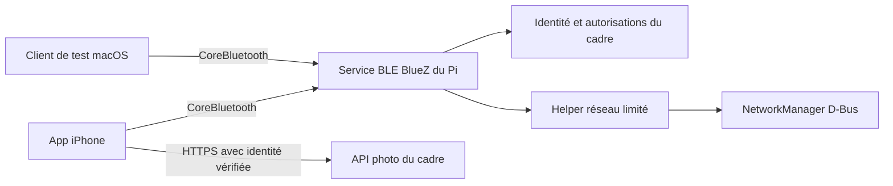

# Inky Studio — plan d’évolution iPhone, Bluetooth et InkyOS

Date : 27 septembre 2026. **Direction validée ; réalisation en cours.** Mehdi a
choisi les thèmes système et l’icône A, en demandant de conserver le style arrondi
de l’app précédente et de retirer les noms des photos/fichiers. Cette correction
prime sur les formes et les titres de photos des planches exploratoires.
La bêta TestFlight **1.0.0 (3)** a depuis été livrée et Mehdi a validé la recette
iPhone. La PR #8 est fusionnée. InkyOS reste explicitement une phase ultérieure.

État au 27 septembre après cette validation : le lot A est livré ; le backend du
lot B et sa candidate `0.5.0-rc.1` sont testés, y compris sur le Pi avec des données
synthétiques, puis déployés après migration administrative du lanceur. Le secret
initial fonctionne toujours ; la personnalisation est disponible dans l’app. Le banc C1 valide le transport réel, pas l’identité.
C2 est en préparation et ne configure encore aucun Wi-Fi.
[Livraison serveur et étape restante](SERVER-CANDIDATE-DELIVERY.md).

Visuels : [Bento 2](../../design/ios/2026-09-27-refinement/README.md).
Audit : [constats et limites](reviews/2026-09-27-ux-audit.md).
Distribution publique : [plan App Store existant](APP-STORE-PLAN.md).

## 1. Produit cible et décisions recommandées

Un cadre que l’on peut préparer sans terminal : installer l’image sur microSD,
allumer, reconnaître le cadre dans l’app, configurer son Wi-Fi et envoyer une photo.
L’usage quotidien reste local, simple, en quatre onglets.

- Conserver le Bento noir/blanc approuvé, avec peu de bleu et d’ambre.
- Conserver les cartes et boutons arrondis existants ; retirer les noms techniques
  dans Cadre, File et Historique, y compris de leurs annonces VoiceOver.
- Portrait uniquement, interface suivant automatiquement le thème iOS.
- Appareil photo et Photos mènent au même traitement/cadrage.
- Personnaliser le **mot de passe d’accès au cadre**. Il est distinct du secret
  Wi-Fi et du mot de passe Linux/SSH ; l’app ne devient pas un outil sudo.
- Bluetooth sert à reconnaître/configurer le cadre et à récupérer une connexion
  réseau. Les photos continuent de passer par le réseau local.
- Construire les services sur le Raspberry existant avant de fabriquer InkyOS.
- Garder l’accès familial à distance dans un lot séparé : BLE n’apporte pas un
  accès Internet entre deux foyers.

## 2. Existant vérifié et évolutions nécessaires

Le tableau ci-dessous conserve le **point de départ de l’audit**, avant le build 3.
Pour les réalisations et limites actuelles, consulter le
[rapport de validation iPhone](reviews/2026-09-27-refinement-validation.md), la
livraison serveur ci-dessus et la [décision C2](BLE-C2-SECURITY-DECISION.md).

| Besoin | Existant | Travail nécessaire |
|---|---|---|
| Vide supérieur | Les quatre grands titres sont invisibles sur iOS 27 ; ils sont visibles sous iOS 18.5. Le titre compact réapparaît après défilement | Corriger le rendu/navigation et les safe areas ; assertions de géométrie |
| Portrait | Deux orientations paysage sont autorisées | Portrait seul dans la source du projet et toutes les présentations |
| Thème système | Clair imposé à trois endroits ; couleurs fixes | Tokens adaptatifs et suppression des overrides SwiftUI/UIKit/plist |
| Icône lisible | Dessin fin et plusieurs blocs sur 1024 px | Choix A/B/C, reconstruction propre et vérification aux petites tailles |
| Caméra | PhotosPicker uniquement ; bon pipeline HEIC/PNG déjà présent | Capture native + permission + même pipeline |
| Mot de passe | Login/logout ; secret généré dans credentials.json | Rotation authentifiée, stockage renforcé, révocation et mise à jour Face ID |
| Bluetooth | Matériel Pi Zero 2 W/Mac compatible ; aucun service de provisioning | Identité, protocole, service Pi, client Mac puis iPhone et tests réels |
| InkyOS | Release applicative et installateur, aucune image SD | Construction reproductible d’une image, premier boot, qualification et maintenance |

Les sources de l’audit donnent les fichiers précis. Les aspects caméra physique,
BLE, grands caractères, et futurs réseaux d’hôtel ne sont pas présentés comme
déjà validés par cet audit.

## 3. Découpage de livraison

| Lot | Résultat visible | Dépendances | Critère de sortie |
|---|---|---|---|
| A — iPhone soigné | Cadre corrigé, quatre onglets harmonisés, portrait, thèmes système, icône, caméra | Validation des planches | Nouveau TestFlight, régression Simulator et test iPhone photo réelle |
| B — accès personnalisable | Mot de passe choisi, Face ID cohérent, récupération définie | Contrat auth serveur et migration | Ancien secret et anciennes sessions invalides ; aucun verrouillage après erreur |
| C1 — banc Bluetooth | Mac découvre le Pi et échange des données synthétiques ; aucune identité authentifiée | Protocole de diagnostic, BLE Pi | Transport et cleanup vérifiés avant conception du provisioning sécurisé |
| C2 — Wi-Fi depuis l’iPhone | Réseau choisi, configuration, reprise et reconnexion | C1, transport protégé, client iOS | Succès sur nouveau LAN, mot de passe erroné récupérable, interruption récupérable |
| D — InkyOS, plus tard | microSD prête à l’emploi, démarrage sans Internet, adoption guidée | B/C stabilisés sur matériel réel | Images vierges indépendantes, aucun secret cloné, vrais tests de premier boot |
| E — sortie publique | App Store, site et documentation cohérents | Lots inclus dans la version qualifiés | Candidat réel testé, App Review et publication manuelle |

L’ordre B/C représente des dépendances de sécurité, pas une obligation d’attendre
InkyOS pour profiter de l’app. Le lot A est livrable indépendamment. Pour avancer
aujourd’hui après validation : commencer par A ; préparer ensuite B et un banc C1
qui ne change pas le réseau de production. La bascule de réseau réelle mérite
un essai contrôlé avec un accès de secours. Pas de promesse de finir toute la
qualification Bluetooth/hôtel/image système dans la même journée.

## 4. Lot A — interface et photo

### Cadre et navigation

Reproduire la zone vide avec le même SDK/runtime, après connexion, retour dans
l’app, changement d’onglet, défilement et apparition/disparition d’une bannière.
Isoler la responsabilité du titre large implicite, de l’inset supérieur global
et des apparences UIKit avant de qualifier la cause. Le titre existe dans
l’arbre d’accessibilité iOS 27 même lorsqu’il n’est pas peint. Le titre compact
réapparaît après défilement dans Cadre et Réglages. Les quatre onglets sont
navigables : les premiers échecs du test iOS 27 provenaient d’un dialogue système
de sauvegarde du mot de passe de test, pas d’une navigation cassée.

Adopter un seul header compact et conserver une marge réelle au-dessus de la
tab bar, quelle que soit son apparence native. Ne pas corriger par des offsets
magiques propres à un modèle d’iPhone. Les bannières d’erreur doivent réserver
leur espace et disparaître sans bande vide. Le bouton d’ajout peut défiler sur
petit écran/texte XXL, mais doit toujours être accessible sans recouvrement.

- **Cadre** : image au ratio du panneau, commandes précédent/suivant, programmation,
  résumé de file et ajout de photo. Ne pas confondre connexion API et état physique
  du rafraîchissement e-ink.
- **File** : aperçu, ordre, prochaine image ; afficher la poignée seulement quand
  le réordonnancement fonctionne. Maintenir les actions accessibles Monter/Descendre.
- **Historique** : date, photo et remise en file ; suppression secondaire, confirmation
  pour un effacement global. Ne pas promettre l’effacement du PNG : l’API actuelle
  ne supprime que les entrées de file/historique.
- **Réglages** : sections ouvrant Programmation, Image, Mon cadre, Sécurité et Aide.
  Conserver toutes les fonctions actuelles dans les sous-écrans, y compris les
  mises à jour, déconnexion et oubli du cadre. Les réglages restent persistants.

### Couleurs et portrait

Définir `canvas`, `surface`, `primaryText`, `secondaryText`, `border`, `action`,
`actionText`, `accent` et états sémantiques en clair/sombre. Retirer les trois
contraintes de thème clair et les couleurs UIKit fixes, y compris dans le crop,
les listes, le Face ID et les feuilles. Suivre le système sans préférence manuelle
pour cette version. Ne pas inverser/assombrir les photos.

Restreindre les orientations iPhone au portrait dans `project.yml`/Info.plist,
puis régénérer le projet. Les capteurs photo peuvent produire une image paysage :
son orientation est normalisée même si l’interface reste portrait.

Mesurer les contrastes du code final et prendre en charge VoiceOver, texte agrandi,
Reduce Motion et contrastes renforcés. Le bleu actuel de petites captions est trop
faible sur blanc. Déclarer également correctement le français dans le projet pour
les dialogues natifs. Garder la navigation native compatible avec les OS ciblés.

### Caméra

« Ajouter une photo » ouvre « Prendre une photo » / « Choisir dans Photos ».
La capture native réutilise le pipeline ImageIO : orientation, décodage borné,
conversion SDR/sRGB, cadrage aux dimensions du panneau, export PNG sans EXIF/GPS.
Pas de second algorithme de couleur ; la palette du panneau reste traitée sur le Pi.

Ajouter `NSCameraUsageDescription`, permission à la demande, refus/récupération
dans Réglages, annulation, reprise et caméra indisponible. Pas de permission micro,
vidéo ou sauvegarde automatique dans Photos pour ce besoin. Réutiliser le picker
système pour la photothèque. Test caméra réel sur iPhone indispensable ; le
Simulator peut tester le pipeline avec une capture injectée.

### Icône

A « Le cadre » est recommandée : symbole plein et épais, soleil bleu unique.
Après choix, créer un asset source éditable, garder une marge interne cohérente,
vérifier 29/40/60/120 px et les variantes d’apparence prises en charge. La planche
générée ne constitue pas l’asset de production ni une mesure de lisibilité.

### Validation A

- Petits/grands iPhone ; iOS 18.5 et runtime récent ; portrait, light/dark et XXL.
- Les quatre titres visibles ; aucune action essentielle masquée ; bannières et
  tab switches sans espace résiduel. Assertions ciblées de frames + revue visuelle.
- Changement de thème pendant une sheet ouverte ; pas de texte illisible.
- Tentative de rotation sur chaque écran et modal : interface en portrait.
- Photos/HEIC et caméra réelle : choisir/capturer → cadrer → envoyer → afficher.
- Face ID, sessions, queue, historique et réglages sans régression.
- Build Release signé, nouvel identifiant de build TestFlight, retour de Mehdi.

## 5. Lot B — mot de passe et identité du cadre

### Rotation authentifiée

Créer un service de rotation partagé par l’API et la CLI. Une route versionnée
ou compatible, par exemple `POST /api/auth/password`, exige une session valide
et le mot de passe actuel. Le nouveau secret est choisi et confirmé dans l’app.
Permettre les phrases de passe, le collage et les gestionnaires de mots de passe ;
définir des bornes raisonnables et identiques serveur/app, sans troncature silencieuse.

Migrer vers un vérificateur salé standard, avec paramètres mesurés sur le Zero 2 W,
plutôt qu’un secret réutilisable en clair. Prévoir la migration des credentials
existants et la récupération ; ne pas retirer la commande « afficher le mot de
passe » sans la remplacer par un parcours explicite de réinitialisation.

Écriture atomique durable, droits limités, sérialisation des changements et logins,
limitation des tentatives, protection des mutations contre les requêtes d’origine
non autorisée, aucune valeur secrète dans les logs/erreurs. Le comportement face
à une coupure pendant l’écriture doit être défini et testé.

Après réussite, révoquer les anciennes sessions HTTP/WebSocket, puis créer une
nouvelle session pour l’appelant ou le reconnecter explicitement. Remplacer le
secret Face ID seulement après confirmation serveur. Si la réponse se perd ou
si le Keychain échoue, proposer une reconnexion avec le nouveau secret et annoncer
l’état exact ; ne jamais restaurer automatiquement l’ancien mot de passe serveur.
Les autres clients, y compris la web app, reviennent proprement à la connexion.

Définir aussi la révocation des autorisations BLE et des clés d’appareils :
invalider les cookies HTTP ne retire pas ce pouvoir. Pour cette version, le
changement de mot de passe révoque les autres téléphones autorisés ; une session
authentifiée de récupération révoque toutes les autorisations et permet d’en
enregistrer une nouvelle. Préciser le renouvellement du code de récupération,
avec sauvegarde vérifiée avant retrait de l’ancien. Tester qu’un téléphone
révoqué ne peut plus reconfigurer le Wi-Fi, y compris sans connexion HTTP.

Le transport actuel HTTP local reste une limite connue. Le parcours de voyage
et toute promesse de sécurité sur un réseau partagé exigent le transport protégé
décrit ci-dessous. Aucune exposition directe du port HTTP sur Internet.

### Identité et récupération

Ajouter une identité de cadre stable indépendante de son IP/SSID. La confiance
repose sur une clé vérifiée, pas seulement un nom ou un UUID annoncé en BLE.
Faire évoluer le stockage Keychain indexé aujourd’hui par URL vers cette identité
vérifiée, avec migration contrôlée de l’installation existante. Établir la confiance
par QR/preuve physique sur le cadre ou canal déjà authentifié ; ne jamais épingler
silencieusement une clé obtenue via HTTP local ou un UUID BLE. Qualifier le
parcours d’adoption sur le Pi existant pendant B/C ; InkyOS l’embarquera ensuite.

L’adoption est une transaction idempotente liée au téléphone initiateur, avec un
seul propriétaire en cours d’enregistrement. Enregistrer et confirmer la preuve
propriétaire sur le téléphone avant de consommer définitivement le jeton initial.
Gérer les réponses perdues et les échecs Keychain sans ouvrir un second claim ni
laisser un cadre adopté sans accès utilisable. Une reprise n’est autorisée qu’au
même initiateur prouvant sa possession de la clé de transaction.

Définir avant le BLE : propriétaire, appareils autorisés, révocation, changement
de téléphone, oubli du secret et code de récupération. Une perte du Wi-Fi ou un
redémarrage ne doit jamais rendre le cadre librement adoptable par un voisin.
Sans propriétaire/récupération disponible, un accès physique local microSD/console
reste possible ; annoncer clairement les conséquences d’un éventuel factory reset.

**Validation B :** ancien mot de passe refusé, nouvelles sessions cohérentes,
révocation des autres clients, Face ID actualisé, erreurs disque/réseau/concurrence
sans corruption, migration depuis v0.4.2 et procédure de récupération éprouvée.

## 6. Lot C — Bluetooth et reconfiguration Wi-Fi

### Architecture

Le BLE sert au protocole de configuration/diagnostic ; il ne transporte pas les
photos. Le helper privilégié reçoit des opérations structurées autorisées, jamais
des commandes shell arbitraires. La connexion BLE est limitée au service Inky,
au premier plan pour la première version.

Le premier spike qualifie advertising/peripheral sur l’OS réel, version BlueZ,
coexistence Wi-Fi/BLE et authentification Secure Connections. Étudier le code
d’appairage affiché sur e-ink avec le délai réel de rafraîchissement. Pour un
parcours QR sans PIN, utiliser un protocole de session authentifié éprouvé,
avec bibliothèque évaluée. Ni proximité, ni « Just Works », ni présence d’un QR
ne suffisent à garantir l’authenticité de l’échange.

L’identité adoptée doit permettre HTTPS avec validation explicite de la clé/
certificat lié au cadre, ou un tunnel privé approprié. Définir la rotation et la
récupération de cette confiance ; ne jamais désactiver la vérification TLS.

### Parcours utilisateur

1. Nouveau cadre : QR/code affiché, identité vérifiée, adoption.
2. Cadre déjà adopté hors ligne : « Changer le Wi-Fi » accessible avant le login
   HTTP, avec preuve de propriété sauvegardée sur le téléphone. Ne pas obliger
   l’utilisateur à oublier le cadre pour réparer sa connexion.
3. Le Pi scanne les réseaux ; l’app affiche SSID/signal/sécurité. Saisie manuelle
   possible pour un réseau masqué. Ne pas prétendre lire la liste des mots de
   passe iOS ou scanner librement les réseaux depuis l’iPhone.
4. Saisie du mot de passe **Wi-Fi**, envoi par session authentifiée/chiffrée.
5. États distincts : association → authentification → adresse IP → API joignable.
   Internet et portail captif sont diagnostiqués séparément.
6. Mise à jour de l’adresse du même cadre vérifié, retour dans Cadre, première photo.

Utiliser un checkpoint/rollback NetworkManager, conserver l’ancien profil, ne
persister le nouveau qu’au bon moment. Si l’ancien réseau est absent, garder un
chemin de reprise BLE. Transactions identifiables, annulation et commandes
idempotentes évitent les configurations concurrentes incohérentes.

Les mots de passe Wi-Fi ne vont pas dans UserDefaults, arguments de processus,
logs ou notifications BLE lisibles. Le Pi doit en conserver un pour reconnecter :
profils NetworkManager protégés, politique de suppression/sauvegarde explicite,
sans prétendre chiffrer automatiquement tout le stockage microSD.

### Banc Mac puis iPhone

Le Mac possède déjà un contrôleur Bluetooth activé avec GATT. Construire un petit
client Swift macOS CoreBluetooth réutilisant le protocole (pas une réécriture de
l’app). Tester découverte, authentification, fragmentation, doublons, débit utile,
interruptions et état avant de modifier un réseau de test.

Puis intégrer dans l’iPhone : permission Bluetooth, scan QR avec permission caméra
si choisi, sélection, erreurs, arrière-plan/interruption et reconnexion. Le
Simulator ne valide pas la radio BLE ; garder des mocks pour les états UI et
tester les échanges sur le vrai Mac/Pi puis le vrai iPhone/Pi.

### Limites réelles des voyages

Le Zero 2 W utilise le **Wi-Fi 2,4 GHz**. Un réseau 5 GHz seul ne fonctionnera pas.
Au départ, qualifier les réseaux personnels WPA2/WPA3 réellement supportés ;
documenter séparément réseau ouvert, entreprise/802.1X et réseau masqué.

Un hôtel peut exiger un portail par appareil et isoler les clients. Le succès
Wi-Fi ne prouve ni Internet ni l’accès iPhone → Pi. Tester un routeur de voyage
ou hotspot compatible comme solutions possibles, sans les annoncer universelles.
Un LAN sans Internet doit quand même permettre les photos locales.

**Validation C :** nouveau LAN, mauvaise clé, coupure d’alimentation/BLE, interruption
de l’app, réseau absent, rollback, ancien profil préservé, refus d’un téléphone
non autorisé, ancien jeton non réutilisable, secrets absents des captures réseau/
logs, IP nouvelle reconnue après vérification d’identité et photos envoyées ensuite.

## 7. Lot D — InkyOS, après stabilisation

InkyOS désigne une image **Raspberry Pi OS Lite préconfigurée**, pas une nouvelle
distribution à maintenir indépendamment. Première cible : Zero 2 W et le panneau
Inky réellement qualifié. Étendre ensuite la matrice matériel/écran.

Comparer `pi-gen` arm64 et `rpi-image-gen` avec un premier build reproductible.
Épingler commit de l’outil, version OS, dépendances et version Inky Studio. Le
défaut courant de pi-gen ne constitue pas une base validée ; mesurer le couple
OS/driver/GPIO (actuellement inky 2.3.0) sur le matériel. Utiliser un builder Linux
ARM64 adapté plutôt que promettre un build système natif simple sur macOS.

L’image embarque tout pour le démarrage **hors ligne** : application, pilotes,
SPI/I²C nécessaires, BlueZ, NetworkManager et services. Compte de service dédié,
privilèges réduits ; SSH désactivé par défaut. Une absence d’écran réel ne doit
pas être masquée par le mode mock comme si l’installation était réussie.

Au premier boot réel, après disponibilité de l’aléa système :

1. Initialiser stockage/configuration et identité unique ; aucun secret, clé TLS,
   clé hôte SSH, credential personnel ou jeton partagé dans l’image publiée.
2. Afficher « Configurez votre cadre » avec QR/code d’adoption temporaire unique.
   Ce code est distinct du mot de passe final choisi par l’utilisateur.
3. Démarrer le BLE pour une adoption authentifiée. Le QR est traité localement,
   pas transmis comme URL contenant un secret à un service public.
4. Configurer Wi-Fi et mot de passe personnel ; proposer Face ID et sauvegarde
   d’une récupération indépendante.
5. Finaliser la transaction d’adoption qualifiée en B/C : preuve propriétaire
   sauvegardée et confirmée, état adopté durable, puis jeton initial invalidé
   AVANT de remplacer son image. L’écran e-ink peut conserver l’ancien QR hors
   tension, mais celui-ci doit être inutilisable. Une réponse perdue doit pouvoir
   être reprise par le même initiateur sans nouvelle adoption.
6. Afficher la première photo. Au redémarrage, retrouver le propriétaire et les
   profils existants ; aucune nouvelle adoption automatique.

Tester deux cartes issues de la même image : identités/jetons différents ;
redémarrage : identité inchangée ; coupure à chaque étape : reprise cohérente ;
ancien QR : refus ; absence d’Internet : setup possible ; problème GPIO : diagnostic.
Flasher une carte de test dédiée, pas la carte de production de Mehdi.

Publier image compressée, manifeste, checksum, procédure de vérification et guide
de récupération. Prévoir les mises à jour OS, la compatibilité des données et un
retour arrière testé. Séparer clairement releases OS et releases app : l’updater
actuel choisit `releases/latest` puis le premier `.tar.gz`, ce qui est incompatible
avec l’ajout non réfléchi d’images système dans le même canal.

## 8. Publication, maintenance et décisions restantes

Chaque lot reçoit des commits/PR ciblés, ses tests adaptés et, si l’app change,
un nouveau build TestFlight. Versionner les capacités API ; une ancienne app et
un ancien serveur doivent rester utilisables ou afficher une explication claire,
pas une erreur JSON incompréhensible. Ne pas exposer un bouton Bluetooth/mot de
passe actif avant que le serveur compatible ne soit détecté.

Mettre à jour aide, politique de confidentialité, descriptions de permissions,
manifest et réponses App Privacy pour le candidat réellement livré. BLE/Wi-Fi
restent locaux, mais la politique doit décrire le stockage réel des secrets et
les diagnostics. La future famille à distance changerait cette analyse.

Conserver le plan App Store existant : accès de démonstration pour la review,
textes/captures conformes au build, test réel, soumission puis publication manuelle.
Le prochain TestFlight A ne dépend pas de la fabrication d’InkyOS.

À décider après présentation : direction visuelle et icône ; périmètre exact de
la première sortie publique ; support initial des modèles/écrans ; méthode
d’adoption validée au banc. Le mot de passe personnalisé, lui, est déjà demandé.

## Références techniques primaires

- [Apple — thème système](https://developer.apple.com/documentation/swiftui/environmentvalues/colorscheme)
- [Apple — interface sombre](https://developer.apple.com/documentation/uikit/supporting-dark-mode-in-your-interface)
- [Apple — icônes](https://developer.apple.com/design/human-interface-guidelines/app-icons)
- [Apple — capture native](https://developer.apple.com/documentation/uikit/uiimagepickercontroller)
- [Apple — CoreBluetooth](https://developer.apple.com/documentation/corebluetooth/)
- [Apple — exemple BLE et appareil physique](https://developer.apple.com/documentation/accessorysetupkit/setting-up-and-authorizing-a-bluetooth-accessory)
- [BlueZ — GATT](https://github.com/bluez/bluez/blob/master/doc/org.bluez.GattCharacteristic.rst)
- [BlueZ — agent d’appairage](https://github.com/bluez/bluez/blob/master/doc/org.bluez.AgentManager.rst)
- [NetworkManager — checkpoint et rollback](https://networkmanager.dev/docs/api/latest/gdbus-org.freedesktop.NetworkManager.html)
- [NetworkManager — stockage des profils](https://networkmanager.dev/docs/api/latest/nm-settings-keyfile.html)
- [Raspberry Pi — matériel](https://www.raspberrypi.com/documentation/computers/raspberry-pi.html)
- [pi-gen officiel arm64](https://github.com/RPi-Distro/pi-gen/tree/arm64)
- [rpi-image-gen officiel](https://github.com/raspberrypi/rpi-image-gen)
- [Apple — portails captifs](https://support.apple.com/en-ie/102554)

Ces références ont été consultées pour l’analyse ; leurs versions et conditions
seront revalidées lors de l’implémentation de chaque lot.
