# Captures de la revue Bento

Captures réelles sur l’unique simulateur local iPhone 15 Pro Max / iOS 27.
Les quatre onglets ci-dessous utilisent un cadre simulé sur loopback et des
photos synthétiques. Les parcours démo ne se connectent à aucun cadre.
Les PNG sont conservés sans retouche ; leur provenance et leur SHA-256 figurent
dans [captures.json](captures.json).

## Les quatre onglets

| Onglet | Clair | Sombre |
|---|---|---|
| Cadre | 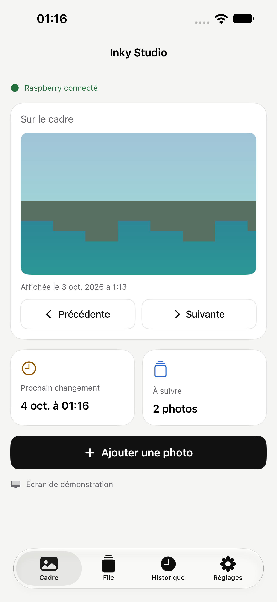 | 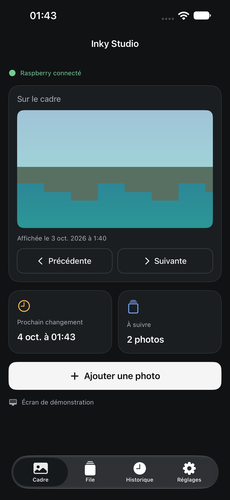 |
| File | 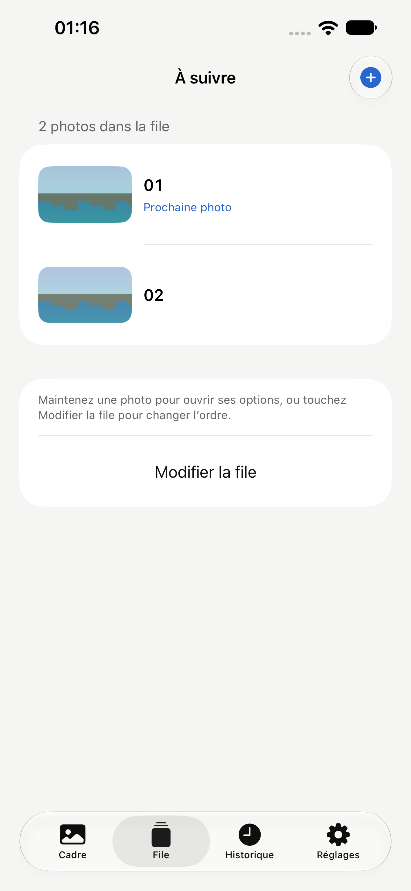 | 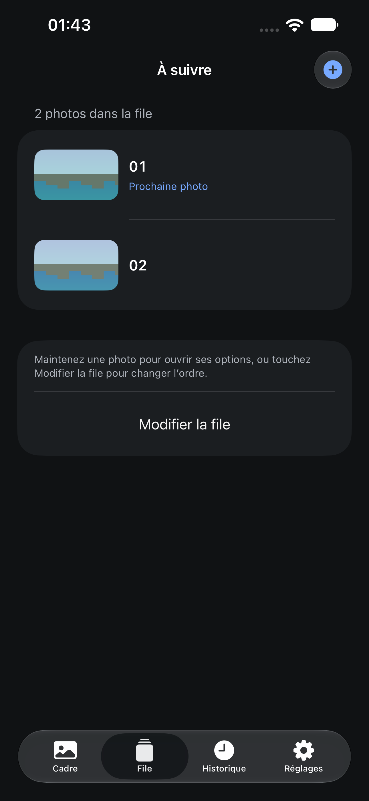 |
| Historique | 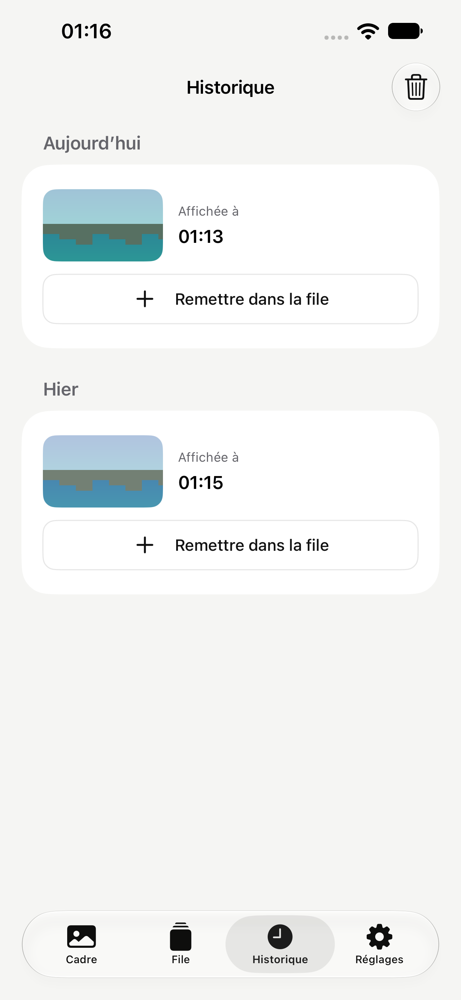 | 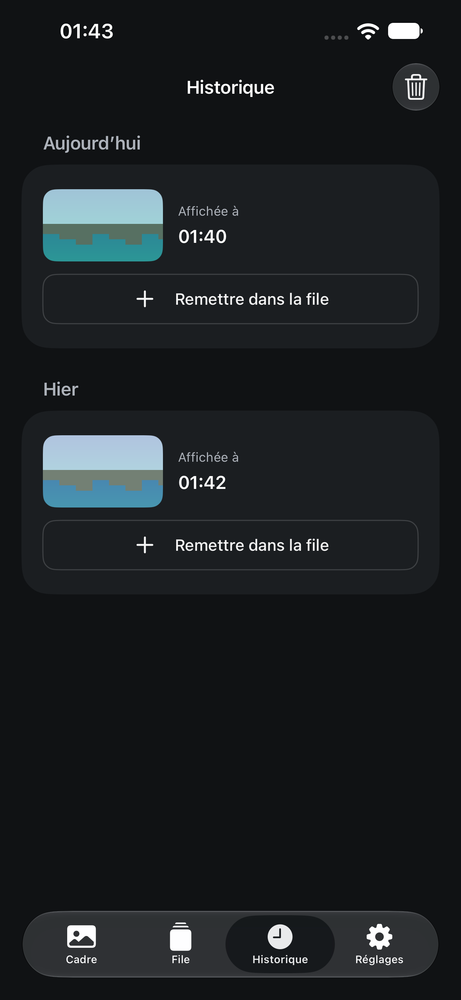 |
| Réglages | 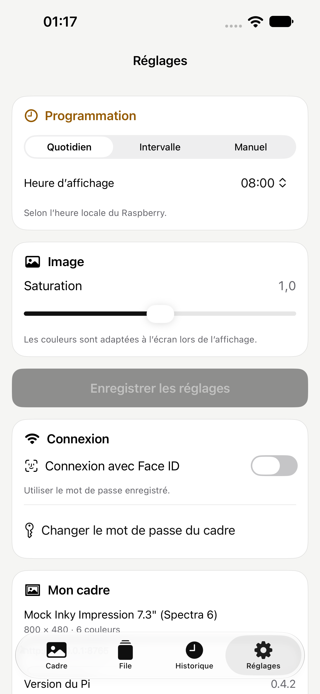 | 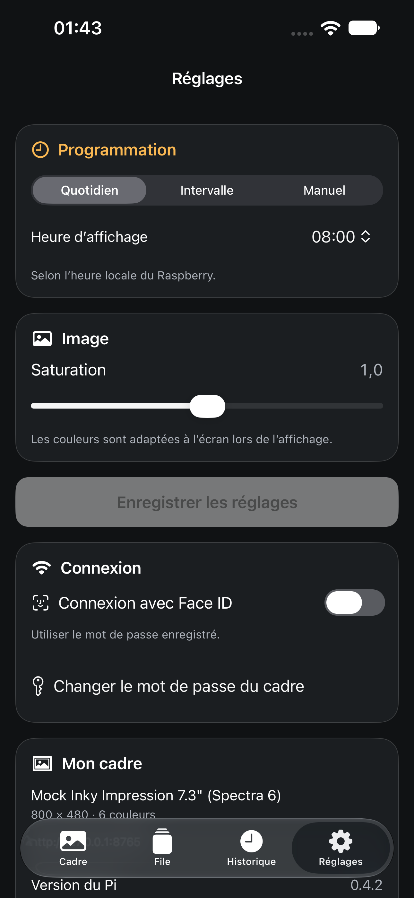 |

## Ajouter une photo

| Étape | Clair | Sombre |
|---|---|---|
| Sources disponibles en démo | 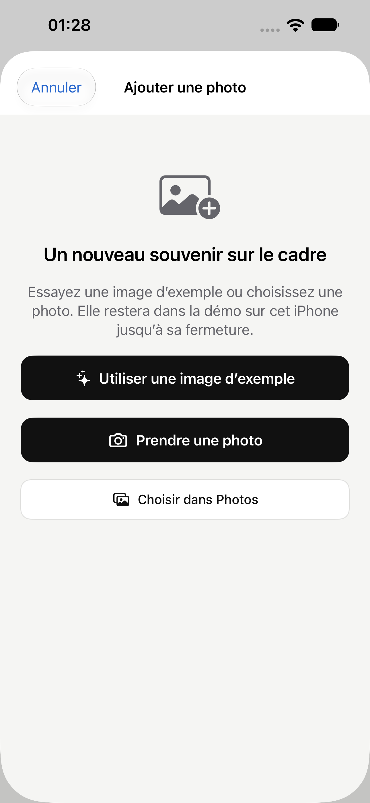 | 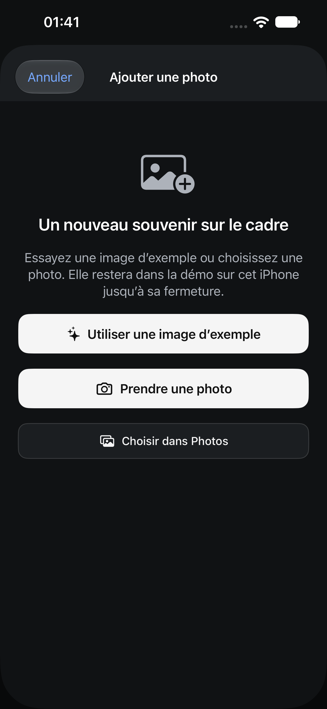 |
| Cadrage local | 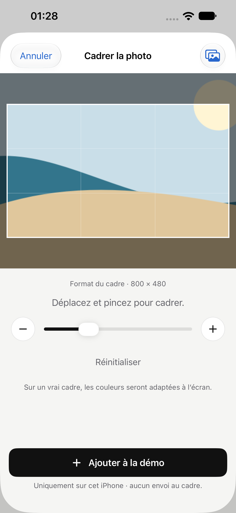 | 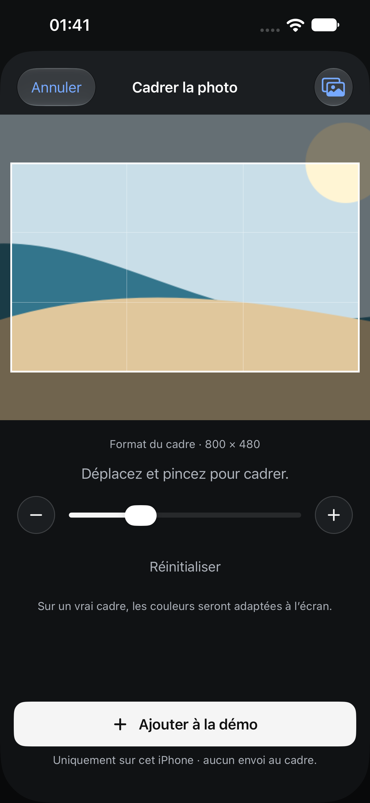 |

Le bouton d’image d’exemple appartient uniquement à la démo. Le parcours connecté
propose [Photos et Appareil photo](parcours/sources-connectees.png).
Le [cadrage depuis Photos](parcours/cadrage-photos.png) utilise une image
synthétique injectée dans la photothèque du simulateur.
Le [refus d’accès à la caméra](parcours/camera-refusee.png) permet de revenir
à l’app ; la capture ne qualifie pas une caméra physique.

## Texte à la taille d’accessibilité maximale

Ces captures sont en mode clair, après la dernière correction du cadrage.

| Cadre | File |
|---|---|
| 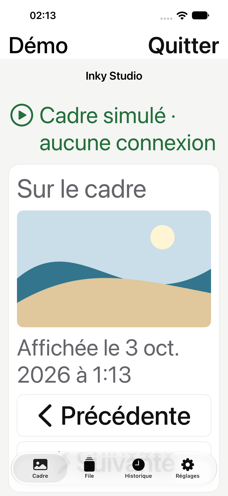 | 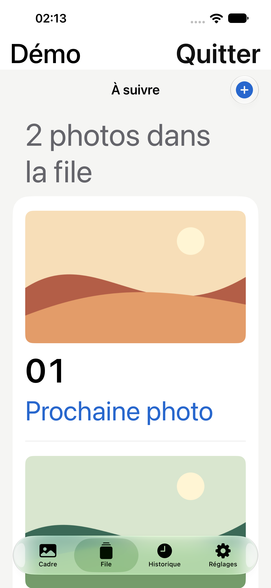 |

| Historique | Réglages |
|---|---|
| 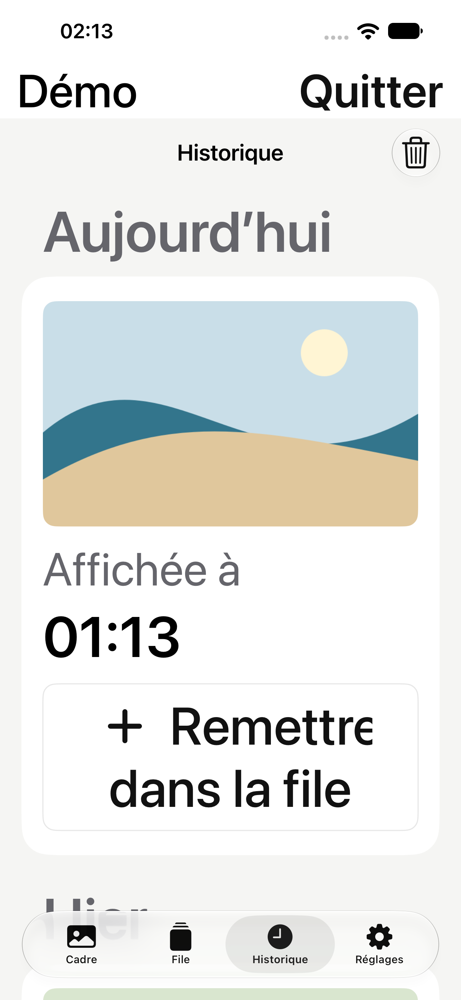 | 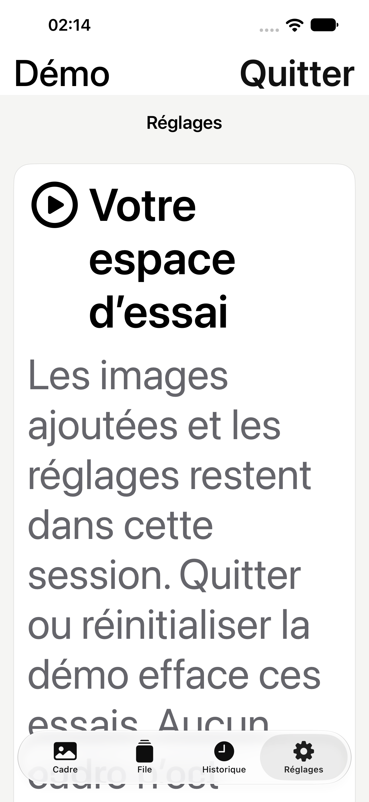 |

Les écrans se parcourent par défilement. Le cadrage conserve un aperçu à la
proportion de l’écran du cadre, puis expose ses réglages et l’envoi dans le
contenu défilant :

| Aperçu | Zoom | Envoi |
|---|---|---|
| 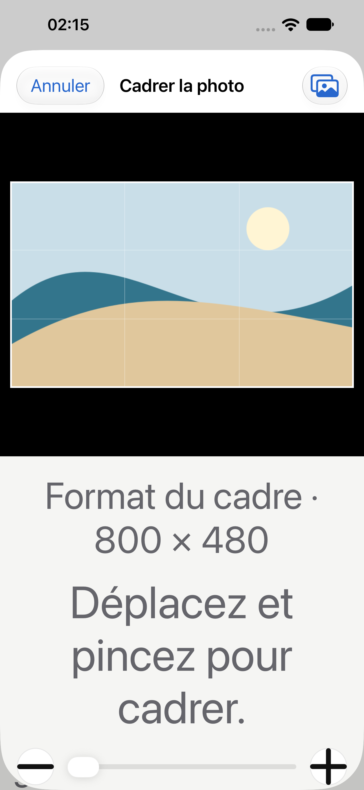 | 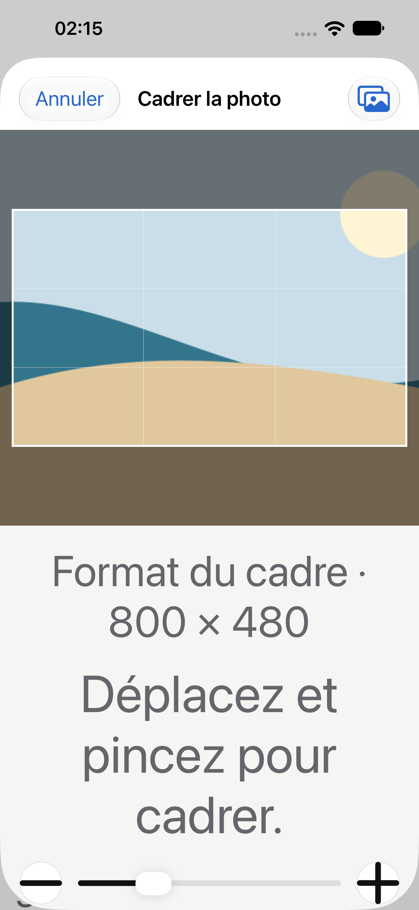 | 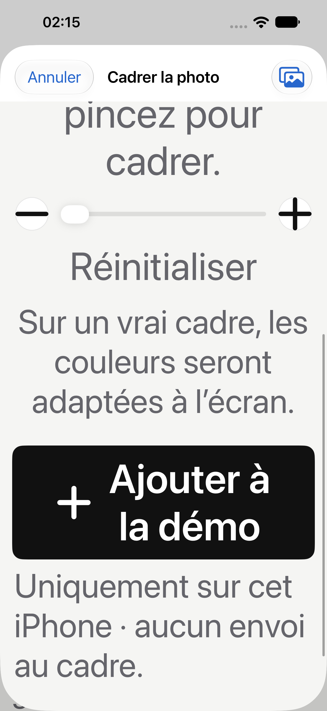 |

## Aide et états particuliers

- [Accueil](parcours/accueil.png) et [Premiers pas](parcours/guide.png).
- [Changer le mot de passe](parcours/mot-de-passe.png) et
  [explication lorsque les mots de passe sont identiques](parcours/mot-de-passe-identique.png).
- Réseaux Wi-Fi simulés : [clair](parcours/wifi-light.png), [sombre](parcours/wifi-dark.png).
- Wi-Fi : [rejoindre le réseau avec l’iPhone](parcours/wifi-confirmation.png),
  [annulation](parcours/wifi-annulation.png).
- [Connexion indisponible et reprise](parcours/connexion-indisponible.png).

Les fixtures Wi-Fi vérifient l’interface et ses états ; elles n’effectuent aucun
changement de réseau réel.
