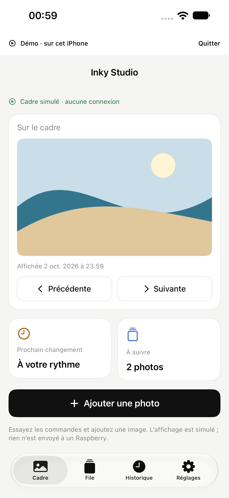
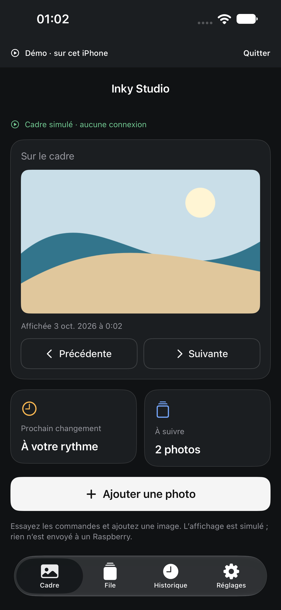
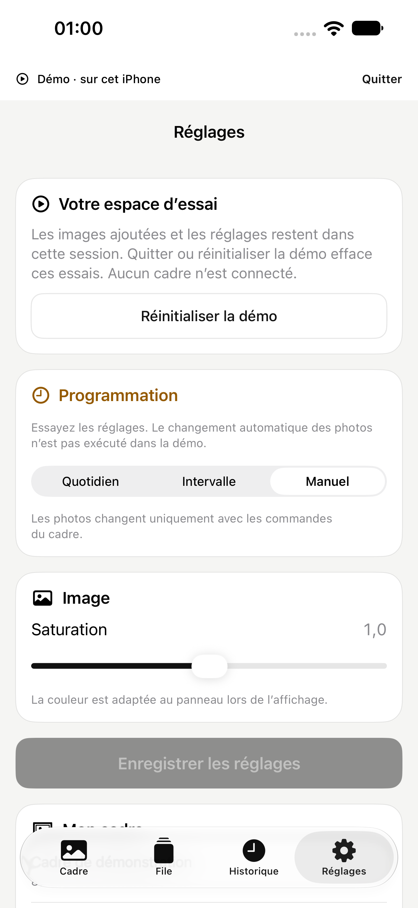
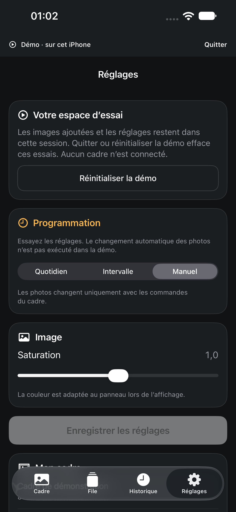

# Revue Bento iPhone — 3 octobre 2026

Le Bento arrondi reste la direction retenue : grande photo prioritaire, cartes
blanc/noir, bleu et ambre discrets, quatre onglets natifs. Cette passe affine la
lisibilité et les consignes sans changer l’architecture des écrans ni l’icône A.

**[Ouvrir la galerie des écrans après correction](GALLERY.md).**

## Périmètre et provenance

- Base : `39fa57d882e80b78976c7027656537aea9b91d2e`, branche
  `codex/ios-demo-onboarding` (PR #12).
- App native reconstruite avec Xcode 27.0 (`27A266a`). Un seul appareil local, sans créer de nouveau simulateur :
  **iPhone 15 Pro Max, iOS 27.0**, `8DDF249D-F872-4323-91FB-88256132DCCE`.
- 36 captures PNG réelles exportées des attachments XCTest, sans retouche. Démo
  publique et fixture HTTP sur loopback ; les paysages sont synthétiques.
  Aucun compte, réseau Wi-Fi ou photo personnels utilisés.
- Référence : [direction validée](../../../../design/ios/2026-09-27-refinement/README.md)
  et [validation des arrondis](../2026-09-27-refinement-validation.md).
- Les dates/heures et l’historique dépendent du moment de capture. Les barres
  natives suivent iOS ; le canevas rectangulaire de cadrage conserve le format
  physique du panneau.

## Constats et corrections

| Constat | Correction | Portée |
|---|---|---|
| Deux cartes de résumé légèrement inégales sur Cadre | Surfaces de même hauteur, contenu aligné en haut | Mise en page, disposition verticale conservée en grand texte |
| Textes secondaires trop pâles en clair | Gris opaque adaptatif, repris dans les onglets et sous-écrans | Palette et hiérarchie conservées |
| Messages d’erreur en rouge système peu contrasté | Couleur d’erreur Bento adaptative | Messages et validation inchangés |
| Caméra/Photos/envoi redéfinissaient les styles des boutons | Styles Bento partagés, états pressé/désactivé et retour à la ligne cohérents | Import et cadrage conservés |
| À la taille d’accessibilité maximale, la barre d’envoi fixe prend trop de place dans le cadrage | Action intégrée au contenu défilant aux tailles d’accessibilité | Barre fixe conservée aux tailles standard ; zoom et envoi accessibles par défilement |
| Après le défilement des sources photo, le cadrage s’ouvre trop bas et cache l’aperçu | Position réinitialisée pour chaque nouvelle image | Le test exige un aperçu visible immédiatement, avant tout défilement |
| Défilement promis même en mode manuel | Consignes explicites sur File, Suivante et la programmation | Aucun changement du moteur de programmation |
| Appui long présenté comme déplacement direct | Texte indiquant les options et Modifier la file | Gestes natifs conservés |
| Mot de passe identique : bouton grisé sans raison visible | Explication au niveau des champs | Même validation, aucune requête de changement pour ce cas |
| Lien des réglages de l’app proposé pour changer de Wi-Fi | Chemin Réglages → Wi-Fi et retour à Inky Studio expliqués | Aucun deep link privé ni changement réseau automatique |
| « Toutes les 1 min », tutoiement isolé, « panneau » et date sans « le » | Français harmonisé et vocabulaire utilisateur | Correctifs rédactionnels |
| Fermeture d’erreur de 32 pt | Cible de 44 pt ; Réessayer également explicite | Contrôles plus faciles à toucher |

## Contraste des couleurs de texte

Calcul de luminance sRGB sur les valeurs opaques de `Bento.swift`, par rapport
aux deux fonds Bento. Le seuil de référence du texte courant est
[4,5:1 (W3C)](https://www.w3.org/WAI/WCAG22/Understanding/contrast-minimum.html).

| Texte | Clair / fond | Clair / carte | Sombre / fond | Sombre / carte |
|---|---:|---:|---:|---:|
| Principal | 17,295 | 18,871 | 17,178 | 15,319 |
| Secondaire | 5,306 | 5,790 | 8,803 | 7,851 |
| Bleu | 4,919 | 5,367 | 7,959 | 7,098 |
| Ambre | 5,209 | 5,684 | 10,725 | 9,564 |
| Succès | 5,549 | 6,055 | 9,639 | 8,596 |
| Erreur | 5,919 | 6,458 | 8,409 | 7,500 |

Ces mesures ne couvrent pas les photos, composants système, surfaces translucides
ou contrôles désactivés. Elles ne constituent pas un audit WCAG global ni un test
VoiceOver manuel complet.

## Comparaison avant correction

| Cadre clair | Cadre sombre |
|---|---|
|  |  |

| Réglages clairs | Réglages sombres |
|---|---|
|  |  |

La revue des captures après un premier test fonctionnel réussi a également
révélé [le cadrage ouvert trop bas en grand texte](before/cadrage-grand-texte.png).
Ce défaut ne bloquait pas l’envoi, mais masquait la photo à cadrer ; il a été
corrigé et couvert par une assertion sur la visibilité initiale de l’aperçu.

## Vérification

**Bilan local : 103 tests unitaires réussis et 14 parcours UI distincts réussis,
avec 1 test Face ID ignoré.** Les résultats proviennent d’une passe complète
puis de relances ciblées après correction ; ce n’est pas le décompte d’une
exécution unique sur le dernier commit. Les bundles locaux sont sous `build/ios/` et ne sont pas versionnés.

| Passe | Résultat |
|---|---|
| Référence avant modification, clair et sombre | Parcours public de démo réussi dans chaque apparence |
| Première passe complète (`bento-after-light`) | 103 tests unitaires réussis ; UI : 11 réussis, 3 échecs investigués, 1 ignoré (Face ID) |
| Relance claire (`bento-recheck-light`) | 103 tests unitaires réussis ; guide grand texte, démo complète et refus caméra réussis ; échec du cadrage grand texte reproduit avant sa correction |
| Passe sombre (`bento-final-dark`) | 103 tests unitaires réussis ; démo complète et quatre onglets connectés avec verrouillage portrait réussis ; échec du banc de défilement grand texte investigué |
| Démo avec le banc corrigé (`bento-centered-gestures`) | 3/3 réussis : parcours complet, guide et import en grands caractères |
| Aperçu initial corrigé (`bento-crop-preview`) | 2/2 réussis : aperçu visible immédiatement en grand texte, zoom/réinitialisation/envoi, et import depuis Photos |
| Build Release iPhone (`bento-release-crop-preview.log`) | Réussi, signature désactivée, sur le code final `7f9348f` |

Les premiers échecs ont distingué deux problèmes de banc et un défaut réel :
accès trop tôt à une ligne virtualisée / contrôle masqué par la barre native,
attente trop courte de la permission caméra, et barre d’envoi du cadrage trop
envahissante en grand texte. Les helpers ont été corrigés sans supprimer leurs
assertions ; la barre d’envoi défile désormais aux tailles d’accessibilité.
La suite Face ID est conditionnelle à une biométrie simulée configurée ; son
absence de résultat n’est pas présentée comme une qualification matérielle.

La passe sombre a aussi révélé un geste de banc placé dans la marge d’une liste
groupée : la troisième photo avait été ajoutée, mais le test ne remontait pas
jusqu’au compteur. Les gestes des listes sont désormais centrés sur leur contenu
visible. Les vérifications des compteurs après remise en file et import sont
conservées, sans répétition automatique des mutations. Les sept conteneurs
portent des identifiants stables ; les gestes sont ancrés à la fenêtre et centrés
sur le contenu, sauf pour éviter de déplacer la photo pendant le cadrage.
Les essais intermédiaires du banc restent dans les journaux locaux
`bento-accessibility-final`, `bento-accessibility-qualified` et
`bento-stable-containers` ; ils ne constituent pas des passes réussies.

La [CI sur `a6d8e60`](https://github.com/mehdi7129/inky-studio/actions/runs/37077640707)
a réussi 103 tests unitaires et 12 tests UI, avec Face ID ignoré et deux échecs
dans les helpers de grand texte. Ces helpers ont ensuite été corrigés et
requalifiés localement. Consulter les checks de la [PR #19](https://github.com/mehdi7129/inky-studio/pull/19)
pour le résultat GitHub sur le dernier commit.

Les captures sont relues pour les arrondis, les marges, la hiérarchie, les
retours à la ligne et les commandes accessibles. Une section partiellement
visible en bord d’écran appartient au contenu défilant ; ce n’est pas une
capture de page complète.

Les tests UI utilisent le bouton public de démo, les services synthétiques et
les identifiants d’accessibilité. Ils contrôlent les actions et l’accès aux
commandes ; les captures sont également inspectées visuellement. Le test grand
texte emploie la taille d’accessibilité maximale et parcourt les quatre onglets,
les sources photo et le cadrage.

Cette PR ne qualifie pas une caméra physique, Face ID réel ou les échanges radio
Bluetooth. Elle ne publie ni release Raspberry ni build TestFlight.

## Reproduire

Depuis la racine du dépôt, préparer la dépendance TLS selon `ios/README.md`,
puis démarrer `python3 ios/scripts/mock-server.py` dans un terminal séparé.
L’import Photos nécessite l’image synthétique de
`python3 ios/scripts/seed-simulator-photo.py <UDID>`.

```sh
xcrun simctl ui 8DDF249D-F872-4323-91FB-88256132DCCE appearance light
xcodebuild -project ios/InkyStudio.xcodeproj -scheme InkyStudio \
  -destination 'platform=iOS Simulator,id=8DDF249D-F872-4323-91FB-88256132DCCE' \
  -parallel-testing-enabled NO -resultBundlePath build/bento-light.xcresult \
  CODE_SIGNING_ALLOWED=YES CODE_SIGN_IDENTITY=- test
xcrun xcresulttool export attachments \
  --path build/bento-light.xcresult --output-path build/bento-light
```

Pour une passe sombre, changer l’apparence avec `simctl ui … appearance dark`
et utiliser un nouveau chemin de résultats. Sélectionner `DemoModeUITests`
pour la démo, le guide et les grandes tailles, et
`InkyStudioUITests/testRoundedTabsWithoutFilenamesAndPortrait` pour les quatre
onglets connectés et le verrouillage portrait. Restaurer ensuite l’apparence
initiale. Les résultats `.xcresult` et DerivedData restent hors Git.
